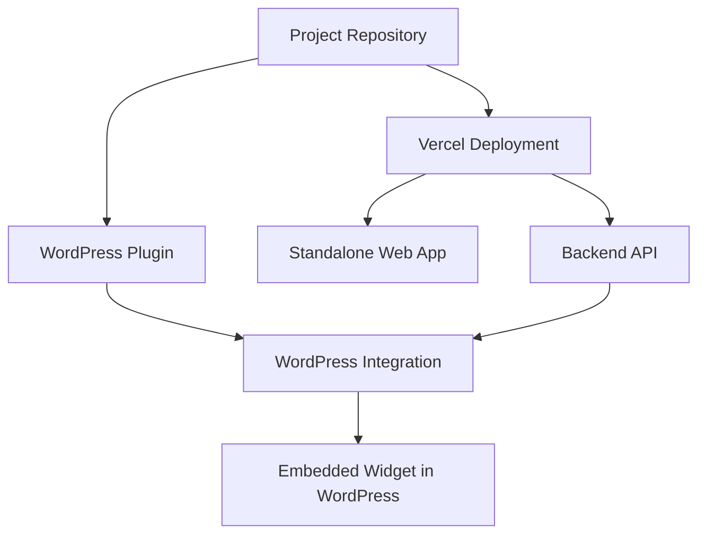

# BookGPT Comprehensive Deployment Guide

This guide provides step-by-step instructions for deploying the BookGPT application in two ways:

1. **Standalone Web Application** - A full web application hosted on Vercel
2. **WordPress Plugin** - An embeddable widget for WordPress sites

## Deployment Overview



## Prerequisites

- Node.js 14+ and npm installed
- Vercel account and CLI installed (`npm i -g vercel`)
- OpenAI API key
- Google Books API key (optional but recommended)
- Amazon Associates Tag (for affiliate links)
- WordPress site (for plugin deployment only)

## Option 1: Standalone Web Application (Vercel)

### Step 1: Clone the Repository

```bash
git clone https://github.com/yourusername/bookgptwp.git
cd bookgptwp
```

### Step 2: Install Dependencies

```bash
npm install
```

### Step 3: Configure Environment Variables

Create a `.env` file in the project root with the following variables:

```
OPENAI_API_KEY=your_openai_api_key
GOOGLE_BOOKS_API_KEY=your_google_books_api_key
WEBHOOK_SECRET=a_random_secure_string
AMAZON_ASSOCIATE_TAG=your_amazon_associate_tag
```

### Step 4: Deploy to Vercel

The simplest way to deploy is using the Vercel CLI:

```bash
vercel login  # If not already logged in
vercel        # For preview deployment
# OR
vercel --prod # For production deployment
```

Alternatively, you can connect your GitHub repository to Vercel for automatic deployments.

### Step 5: Configure Secrets in Vercel

After the initial deployment, make sure to add environment variables in the Vercel dashboard:

1. Go to your Vercel project
2. Navigate to Settings → Environment Variables
3. Add the same environment variables from your `.env` file

### Step 6: Verify Deployment

Once deployed, visit your Vercel URL to confirm the application is working correctly.

## Option 2: WordPress Plugin

### Method 1: Using Pre-built Plugin (Recommended)

#### Step 1: Download the Latest Plugin Release

Download the latest `bookgpt-wp.zip` file from:
- GitHub Releases: https://github.com/yourusername/bookgptwp/releases

#### Step 2: Install the Plugin in WordPress

1. In your WordPress admin, go to Plugins → Add New → Upload Plugin
2. Choose the `bookgpt-wp.zip` file and click "Install Now"
3. After installation, click "Activate"

#### Step 3: Configure the Plugin

1. Go to BookGPT → Settings in your WordPress admin
2. Enter the API URL (from your Vercel deployment)
3. Configure other options as needed (Amazon Associates Tag, widget appearance)
4. Save changes

### Method 2: Manual Build and Installation

Use this method if you need to customize the plugin before installation.

#### Step 1: Clone and Set Up

```bash
git clone https://github.com/yourusername/bookgptwp.git
cd bookgptwp
npm install
```

#### Step 2: Build the Plugin

```bash
# Make sure to deploy to Vercel first to get your API URL
npm run package-plugin
```

This will create `bookgpt-wp.zip` in the `dist` folder.

#### Step 3: Install in WordPress

Follow the same installation steps as in Method 1.

## Usage

### Standalone Web Application

- Access your application at your Vercel URL
- The chat interface will appear automatically
- Users can start typing their book preferences and receive recommendations

### WordPress Plugin

#### Method 1: Automatic Widget

By default, the chat widget appears in the bottom-right corner of your WordPress site.

#### Method 2: Shortcode

Use the shortcode to embed the chat widget in specific pages or posts:

```
[bookgpt]
```

With custom options:

```
[bookgpt position="inline" theme="dark" width="100%" height="500px"]
```

Available options:
- `position`: "default", "inline", or "fixed"
- `theme`: "light" or "dark"
- `width`: Any valid CSS width value
- `height`: Any valid CSS height value

## Troubleshooting

### Vercel Deployment Issues

1. **Missing Environment Variables**: Ensure all required environment variables are configured in Vercel
2. **Build Failures**: Check build logs in Vercel dashboard
3. **API Not Working**: Ensure your OpenAI API key is valid and has sufficient credits

### WordPress Plugin Issues

1. **API Connection Failed**: Check the API URL in plugin settings
2. **Widget Not Appearing**: Ensure the widget is enabled in settings
3. **Styling Conflicts**: Try adjusting the theme or position settings

## Updating

### Standalone Web Application

```bash
# Pull latest changes
git pull

# Redeploy
vercel --prod
```

### WordPress Plugin

1. Download the latest release
2. In WordPress admin, go to Plugins
3. Deactivate the BookGPT plugin
4. Delete the BookGPT plugin
5. Install and activate the new version
6. Reconfigure settings if necessary

## Security Considerations

1. **API Keys**: Never expose your OpenAI API key in client-side code
2. **Webhook Secret**: Use a strong, random string for the webhook secret
3. **Rate Limiting**: Consider implementing rate limiting to prevent API abuse

## Support and Resources

- [GitHub Repository](https://github.com/yourusername/bookgptwp)
- [Issue Tracker](https://github.com/yourusername/bookgptwp/issues)
- [OpenAI Documentation](https://platform.openai.com/docs/)